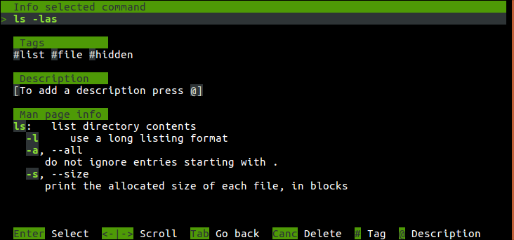

# fastHistory

A python tool connected to your terminal to store important commands and search them in a new and faster way


### Why you need it?

How often do you need to reuse a command but you cannot remember it (or all the needed options/flags)?

```sh
# example of an 'intuitive' and 'obvious' bash command from my bash history
$ srm -lrvz f1 f2 d1/
```

How many times do you search the same command on Google, over and over? 

> 42 times..  yes..  based on my experience the answer is [42](https://www.independent.co.uk/life-style/history/42-the-answer-to-life-the-universe-and-everything-2205734.html)


And how many times have you told yourself to store this *super* useful command but you didn't? 

> I saved them all ..totally, with a good and detailed explanation for each command

if you know what I am talking about, **fastHistory** is the tool you are looking for!


### The tool

**fastHistory** can save your commands directly from your terminal, all you need is a **#**

```sh
$ srm -lrvz f1 f2 d1/ #
                     /\
                      \------- fastHistory will store "srm -lrvz f1 f2 d1/" in its internal database
```

You can specify one or more **tags**


```sh
$ srm -lrvz f1 f2 d1/ #secure #remove #file #directory
```

or a **description**

```sh
$ srm -lrvz f1 f2 d1/ #@delete file and overwrite it 2 times
```

or **both**

```sh
$ srm -lrvz f1 f2 d1/ #secure #remove #file #directory @delete file and overwrite it 2 times
```

Finally, to search your saved commands, all you need is **f**

```sh
$ f secure
```

**fastHistory** will then inject the selected command in your terminal input


Furthermore, for each saved command you can get a fast summary from the man page with details of the used options/flags
**Warning**: this feature currently does not cover the syntax of all commands




# How to install

[Download](https://github.com/mkcn/fastHistory/releases) the most recent version and follow the instructions


# Commands and syntax

#### Simple adding

```
command_to_save [#[tag [#tag ...]][@description]]
```

#### Explicit adding without execution

```
fadd command_to_save [#[tag [#tag ...]][@description]]
```

#### Simple search 

```
f [filter]
```

**OR search**: match any row where **at least one** of the following conditions is true:

* the __filter__ words are contained in the **command** 
* the __filter__ words are contained in the **tags** list
* the __filter__ words are contained in the **description**

#### Advanced search
```
f [filter] [#tag_filter ...] [@description_filter]
```

**AND search**: match any rows where **all** the following conditions are true:

* the __filter__ words are contained in the **command** OR **tags** OR **description**
* the __tag_filter__ words are contained in the **tag** list
* the __description_filter__ words contained in the **description**


License
----

The license for this is the same as that used by GNU bash, GNU GPL v3+.


Copyright
----

The following external projects have been used as part of **fastHistory**:
*  https://github.com/rcaloras/bash-preexec 
    *  **goal**: this bash script is used to hook the commands from the terminal
    *  **code section**: ```bash-preexec.sh```
    *  **changes**: no change
*  https://github.com/idank/bashlex
    *  **goal**: this Python module is used to parse bash commands in order to show info from the man page
    *  **code section**: ```fastHistory/parser/bashlex/```
    *  **changes**: no change 
*  https://github.com/wong2/pick
    *  **goal**: this Python module has been used to select the option from the menu
    *  **code section**: ```fastHistory/pick```
    *  **changes**: all code has been restructured and adapted with a different UI


